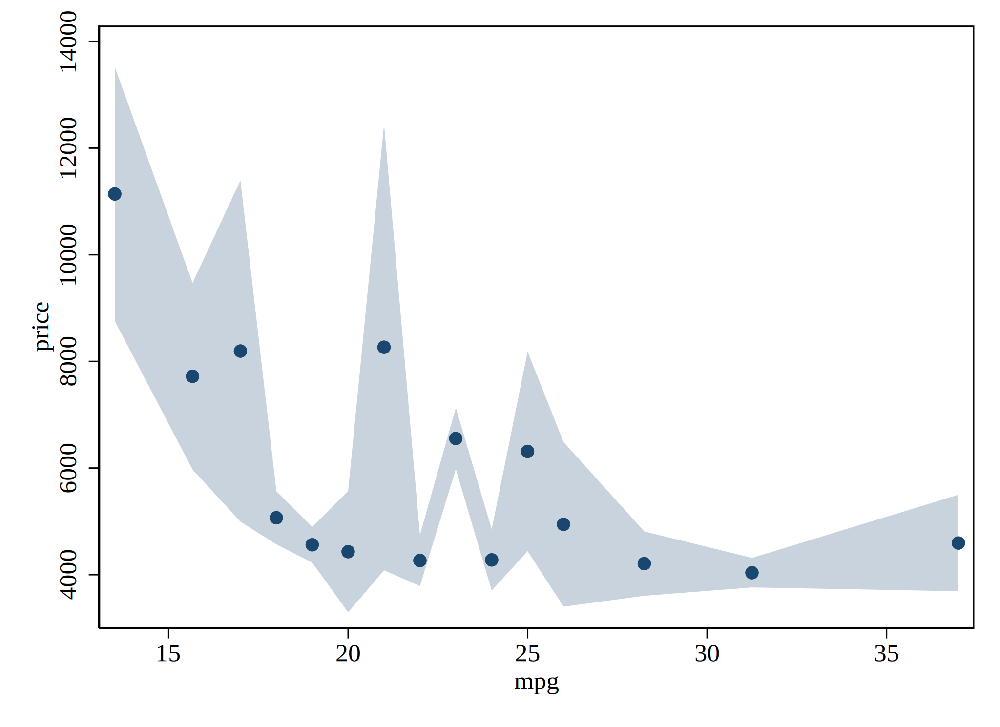
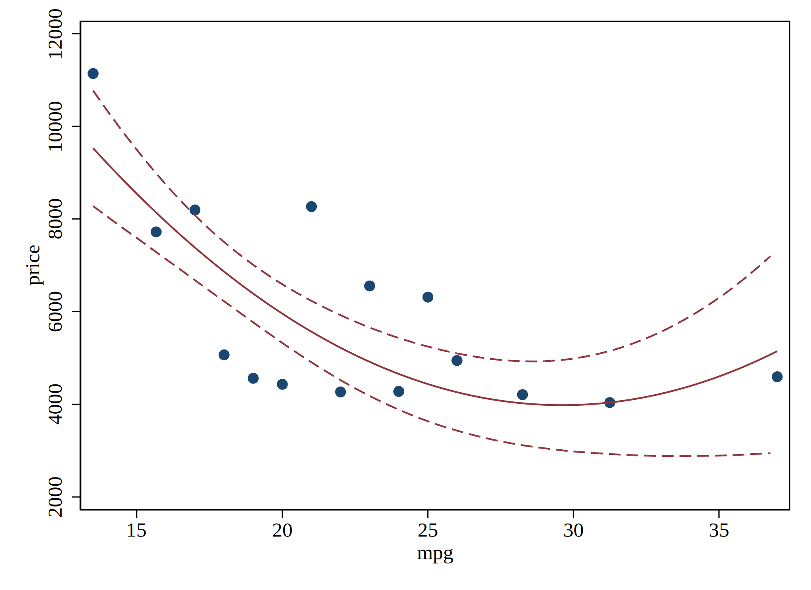
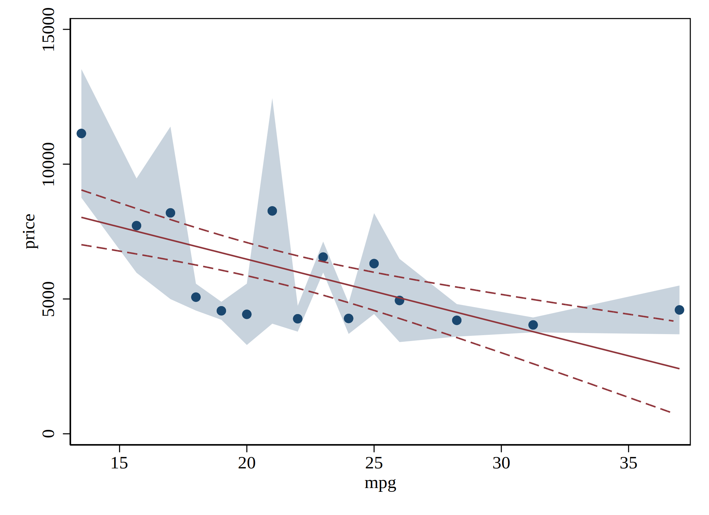

# binscatter: Binned Scatterplots...

binscatter is a Stata program which generates binned scatterplots.  These are a convenient way of observing the relationship between two variables, or visualizing OLS regressions.  They are especially useful when working with large datasets.

[See the project webpage for more information.](https://michaelstepner.com/binscatter/ "binscatter: a Stata program to generate binned scatterplots.")

## ... now with confidence intervals

This version adds support for confidence intervals!  

Add confidence intervals around the conditional means with the option `ci(bins)`, add confidence intervals around fit lines (both `qfit` and `lfit` supported) with `ci(model)`.
Technically, both options can be selected at the same time (though this doesn't usually look good) with `ci(bins model)`.

## Install
Install from within stata

`net install esplot, from("https://raw.githubusercontent.com/dballaelliott/binscatter/master/") replace`

OR 2. Download/clone/fork this repo

### ci(bins)

```stata
sysuse auto, clear 
binscatter price mpg, ci(bins) linetype(none)
```



This helps to highlight the implicit bias-variance tradeoff that `binscatter` shares with other non-parametric conditional means estimators. 

```stata
sysuse auto, clear 
binscatter price mpg, ci(bins) linetype(none) n(5)
```

 Too Few Bins")

Aesthetically, this can look quite nice when we add `linetype(connect)`

```stata
binscatter price mpg, ci(bins) linetype(connect) n(5)
```


### ci(model)

The `ci()` option class also provides an option to bound linear and quadratic fits.

The syntax is exactly the same in either case; `binscatter` knows to bound the appropriate model type, whether it is linear...

```stata
binscatter price mpg, ci(model) linetype(lfit)
```


or quadratic.... 

```stata
binscatter price mpg, ci(model) linetype(qfit)
```



Technically, these options can be specified together, but it often leads to a crowded figure...



### Comments

Ok - what exactly do these confidence intervals represent? Why aren't the bounds on the linear fit also linear? 

to write: 

these minimize (maximize)
<a href="https://www.codecogs.com/eqnedit.php?latex=\hat{y}" target="_blank"></a>
along the manifold given by the constraint function
<a href="https://www.codecogs.com/eqnedit.php?latex=$CDF(\beta)&space;=&space;0.025$" target="_blank"></a>
<a href="https://www.codecogs.com/eqnedit.php?latex=($CDF(\beta)&space;=&space;0.0975)$" target="_blank"></a>

rather, we numerically approximate this. 

in this way, in the linear case, the constraint is in terms of <a href="https://www.codecogs.com/eqnedit.php?latex=$\beta=[\beta_0~\beta_1]^T$" target="_blank"></a>
; in the quadratic case 
<a href="https://www.codecogs.com/eqnedit.php?latex=$\beta=[\beta_0~\beta_1~\beta_2]^T$" target="_blank"></a>


--- 
in line <a href="https://www.codecogs.com/eqnedit.php?latex=\LaTeX" target="_blank"></a> compiled externally by [codecogs](https://www.codecogs.com/)
