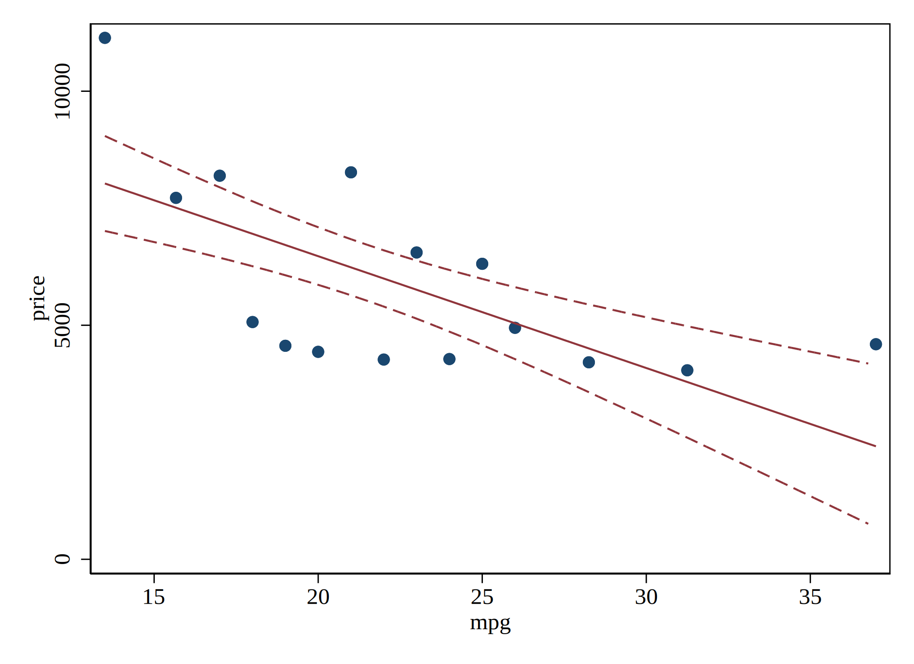

# binscatter: Binned Scatterplots...

binscatter is a Stata program which generates binned scatterplots.  These are a convenient way of observing the relationship between two variables, or visualizing OLS regressions.  They are especially useful when working with large datasets.

[See the project webpage for more information.](https://michaelstepner.com/binscatter/ "binscatter: a Stata program to generate binned scatterplots.")

## ... now with confidence intervals

This version adds support for confidence intervals!  

Add confidence intervals around the conditional means with the option `ci(bins)`, add confidence intervals around fit lines (both `qfit` and `lfit` supported) with `ci(model)`.
Technically, both options can be selected at the same time (though this doesn't usually look good) with `ci(bins model)`.

## Install
Install from within stata

`net install binscatter, from("https://raw.githubusercontent.com/dballaelliott/binscatter/pkg/") replace`

OR 2. Download/clone/fork this repo

### Dependencies

This program uses `reghdfe` to allow for extended `vce` options for standard errors.

`ssc install reghdfe`

### ci(model)

The `ci()` option class provides a suboption to bound linear and quadratic fits.

The syntax is exactly the same in either case; `binscatter` knows to bound the appropriate model type, whether it is linear...

```stata
binscatter price mpg, ci(model) linetype(lfit)
```



or quadratic.... 

```stata
binscatter price mpg, ci(model) linetype(qfit)
```


### ci(bins)

The ci() option class also provides an option to bound the binned y-means.


```stata
sysuse auto, clear 
binscatter price mpg, ci(bins) linetype(none)
```


This helps to highlight the bias-variance tradeoff that `binscatter` shares with other non-parametric conditional means estimators, 

```stata
sysuse auto, clear 
binscatter price mpg, ci(bins) linetype(none) n(5)
```

 Too Few Bins")

Aesthetically, this can look quite nice when we add `linetype(connect)`

```stata
binscatter price mpg, ci(bins) linetype(connect) n(5)
```


Technically, these options can be specified together, but it often leads to a crowded figure...

```stata
binscatter price mpg, ci(model bins) linetype(lfit)
```


### Changelog/ Coming Soon... 
 
- [ ] [Alternative implementation](https://github.com/dballaelliott/binscatter/issues/4) of `ci(bins)` that doesn't rely on tranparency for backwards compatability with versions before Stata 15.0.

- [x] **Quality of life update to `ci(model)`** The option `n_draws()` is now available. This takes an integer argument, and can be used to set the number of draws from the bivariate normal distribution that are used to approximate the confidence bands on the model (more precisely, the bounds on y-hat). The default is 100,000. 

- [x] Installing via `net install` also updates the stata help file so that the internal documentation provided by `help binscatter` includes documentation for the `ci()` option. 

--- 
in line <a href="https://www.codecogs.com/eqnedit.php?latex=\LaTeX" target="_blank"></a> compiled externally by [codecogs](https://www.codecogs.com/)
